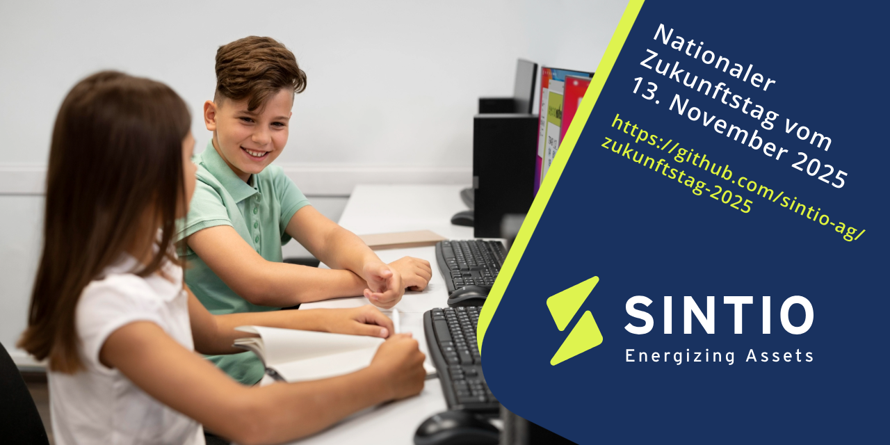
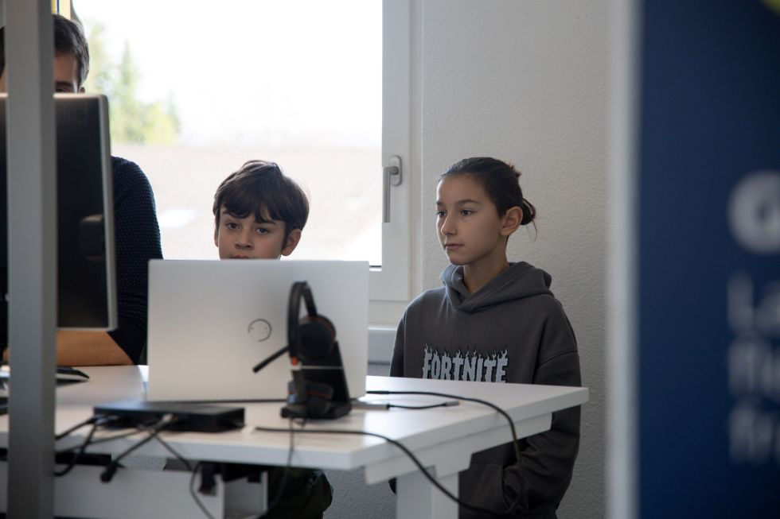
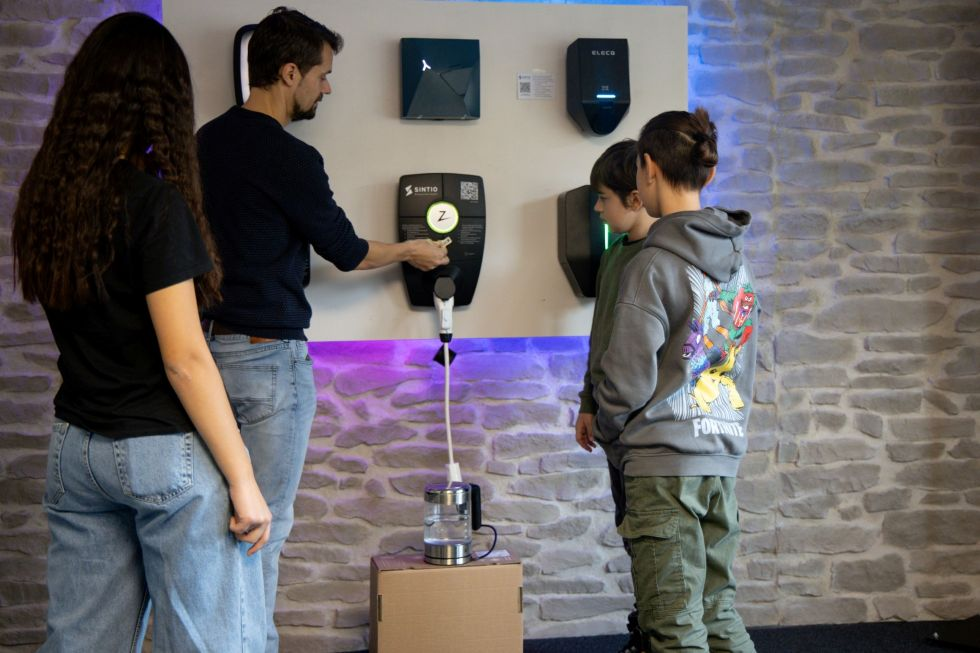
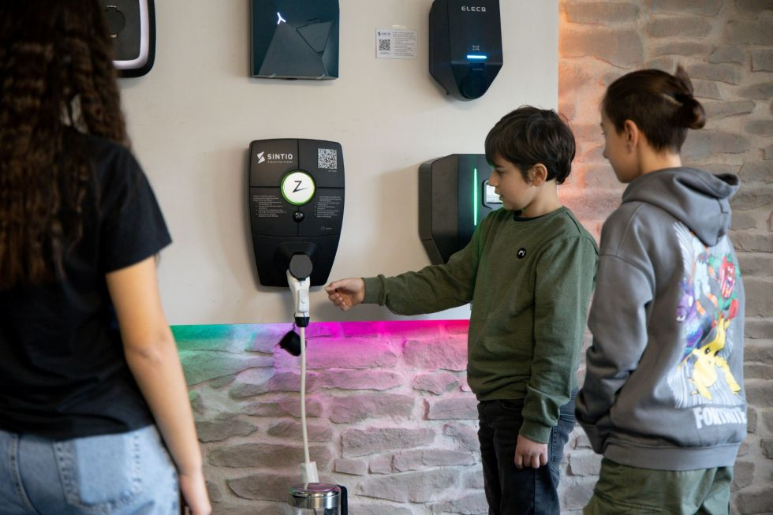
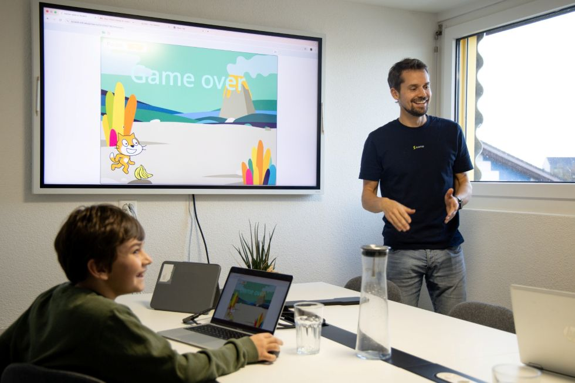
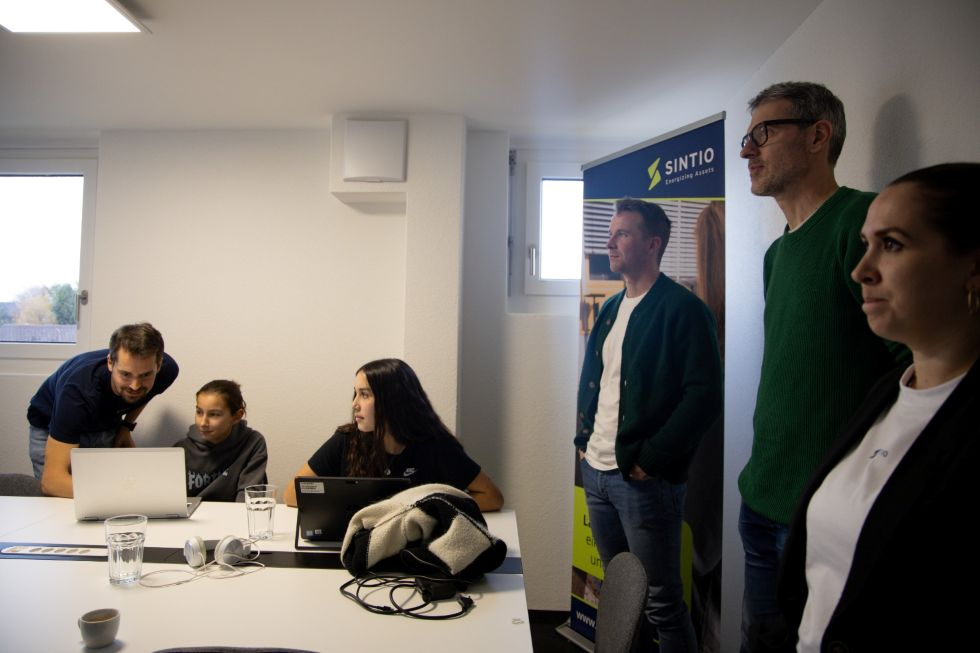

Willkommen zum **Zukunftstag bei Sintio**!

Am **Donnerstag, 13. November 2025**, zeigen wir Kindern der **5. bis 7. Klasse**, wie Software im echten Leben funktioniert – von der **E-Auto-Ladestation** über den **Server** bis hin zum **selbst programmierten Spiel** mit [Scratch](https://scratch.mit.edu/).

## Der Nationale Zukunftstag

Der **Nationale Zukunftstag** bietet Kindern und Jugendlichen praxisnahe Einblicke in Berufe und Arbeitsbereiche, in denen ihr Geschlecht untervertreten ist. Er ermutigt sie, bei der Berufswahl ihre **eigenen Interessen und Talente** in den Vordergrund zu stellen und **Vorurteile zu hinterfragen**.

Weitere Informationen findet man auf [www.nationalerzukunftstag.ch](https://www.nationalerzukunftstag.ch/).

## Was macht Sintio?

**Sintio** ist eine Schweizer Softwarefirma. Wir entwickeln Programme, um **E-Auto-Ladestationen zu betreiben** und den **Stromverbrauch abzurechnen**.

Wenn man ein Elektroauto lädt, muss die **Ladestation** wissen:

- Wer lädt das Auto?  
- Ist diese Person **berechtigt** zu laden?  
- Wie wird der **Strom bezahlt**?

Unsere Software kümmert sich genau darum:

- Sie **verbindet** die Ladestation mit dem Internet.  
- Sie prüft, **ob jemand laden darf**.  
- Sie sorgt dafür, dass der **Strom bezahlt wird**. Wer mehr Strom lädt, bezahlt auch mehr.

Mehr Informationen findet man auf unserer Website [www.sintio.ch](https://www.sintio.ch).

## Welche Berufe gibt es bei Sintio?

Bei Sintio arbeiten Menschen mit ganz unterschiedlichen Aufgaben und Stärken zusammen:

- **Software-Entwickler:innen** programmieren die Anwendungen, die unsere Ladestationen steuern.  
- **System- und Cloud-Spezialist:innen** betreuen die Server, auf denen unsere Software läuft.  
- **UX-Designer:innen** gestalten die Bedienoberflächen so, dass sie einfach und verständlich sind.  
- **Support- und Testingenieur:innen** prüfen, ob alles zuverlässig funktioniert.  
- **Produktmanager:innen** planen neue Funktionen und koordinieren die Entwicklung.  
- **Marketing-Mitarbeitende** erklären unsere Produkte, gestalten Informationsmaterial und planen Kampagnen.  
- **Verkaufs- und Kundenberater:innen** stehen im direkten Kontakt mit unseren Kundinnen und Kunden.  
- **Administration und Buchhaltung** sorgen dafür, dass im Hintergrund alles reibungslos läuft.

Alle diese Berufe tragen dazu bei, dass E-Autos überall einfach und sicher geladen werden können.

## Impressionen vom Zukunftstag

Hier ein paar Eindrücke vom Zukunftstag bei Sintio. Die Kinder konnten nicht nur programmieren, sondern auch echte Ladestationen ausprobieren, unser Büro erkunden und erleben, wie Software im Alltag eingesetzt wird. Die Begeisterung war riesig – und wir freuen uns schon auf den nächsten Zukunftstag!

*Die Kinder schauen unseren Entwickler:innen bei der Arbeit über die Schulter.*

*Online-Meeting mit unseren Entwicklerkollegen im Ausland.*

*Tee kochen mit einem Ladegerät – Elektrizität einmal anders erklärt.*

*Die Kinder entdecken spielerisch, wie Energie im Alltag genutzt wird.*

*Stolze Präsentation der selbst programmierten Scratch-Spiele.*

*Das gesamte Sintio-Team verfolgt die Präsentationen gespannt.*

## Spiele der Teilnehmenden

Neben spannenden Einblicken in den **Arbeitsalltag** bei Sintio, von Softwareentwicklung über Support bis hin zu Marketing und Administration, haben die Kinder auch selbst programmiert.

Jede Teilnehmerin und jeder Teilnehmer hat mit **Scratch** ein eigenes kleines Computerspiel entwickelt. Scratch ist eine **einfache und kindgerechte Entwicklungsumgebung**, ideal für Schülerinnen und Schüler **ab der 4. Klasse**. Mit farbigen Drag-and-Drop-Bausteinen konnten die Kinder ihr Spiel Schritt für Schritt gestalten.

Hier präsentieren wir stolz die Spiele, die am **Zukunftstag 2025** entstanden sind.

### Katzenspiel von Luca

  <iframe src="https://scratch.mit.edu/projects/1242060776/embed" width="100%" height="780"></iframe>

### Katzenspiel von Julien

  <iframe src="https://scratch.mit.edu/projects/1242060796/embed" width="100%" height="780"></iframe>

### Katzenspiel von Ela

  <iframe src="https://scratch.mit.edu/projects/1242061613/embed" width="100%" height="780"></iframe>

